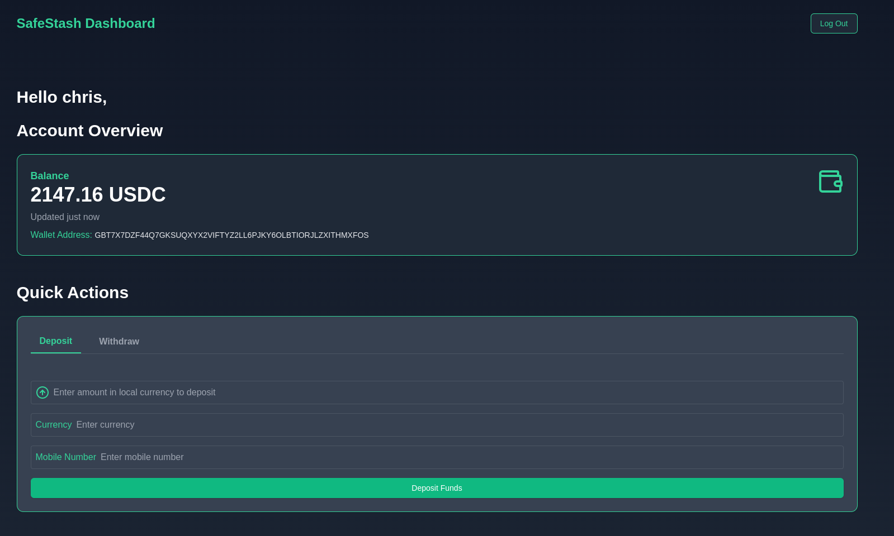
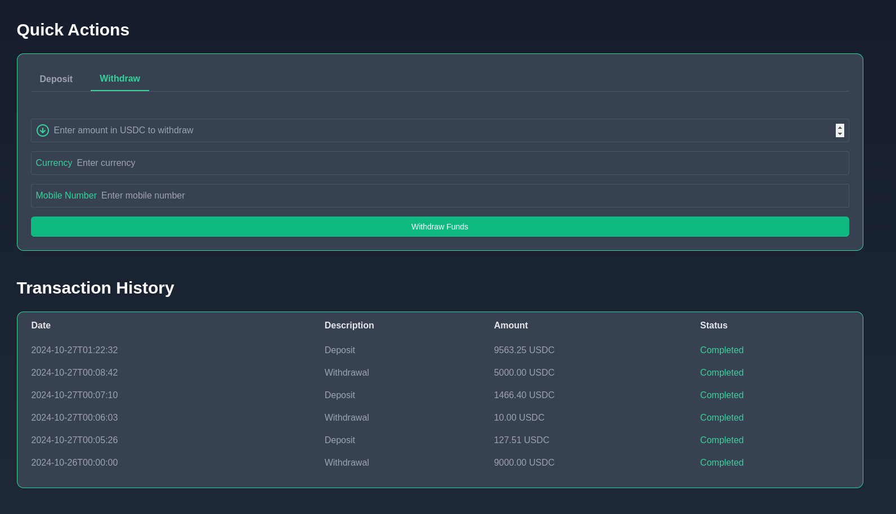

# SafeStash


## Summary

SafeStash is a secure and user-friendly financial management platform designed to empower users in developing nations. It provides a seamless interface for managing digital assets, making deposits, withdrawals, and tracking transaction history. SafeStash aims to enhance financial stability and accessibility through innovative technology.

## Overview of the Design Architecture

SafeStash is built with a modern, scalable architecture that ensures security, performance, and maintainability. The architecture consists of the following key components:

1. **Frontend**: A React-based single-page application (SPA) that provides a responsive and intuitive user interface.
2. **Backend**: A Flask-based RESTful API that handles authentication, session management, and business logic.
3. **Database**: A Supabase PostgreSQL database that stores user data, transaction history, and other relevant information.
4. **Authentication**: Session-based authentication for secure and stateless user sessions.
5. **Third-Party Integrations**: Integration with external services such as Stellar for blockchain transactions, Momo API for mobile money operations, and currency exchange api.

## How It Works

SafeStash operates through a series of well-defined steps to ensure secure and efficient financial management:

1. **User Registration and Authentication**:

   - Users sign up and log in using their email and password.
   - Session-based authentication is used to manage user sessions securely.

2. **Dashboard Access**:

   - Upon successful login, users are redirected to the dashboard.
   - The dashboard provides an overview of the user's account, including balance, recent transactions, and quick actions.

3. **Deposits and Withdrawals**:

   - Users can make deposits and withdrawals through the dashboard.
   - For deposits, users enter the amount, currency, and mobile number.
   - The backend processes the deposit request, interacts with the Momo API for mobile money operations, and updates the user's balance.
   - For withdrawals, users enter the amount and destination details.
   - The backend processes the withdrawal request, interacts with the Stellar network for blockchain transactions, and updates the user's balance.

4. **Real-Time Exchange Rates**:

   - SafeStash integrates with a currency exchange API to provide real-time exchange rates.
   - Users can view the current exchange rates and convert their assets accordingly.

5. **Transaction History**:

   - Users can view their transaction history on the dashboard.
   - The transaction history includes details such as date, description, amount, and status.

6. **Security Measures**:
   - All sensitive data is encrypted and securely stored.
   - HTTP session cookies are used for secure and stateless authentication.
   - CORS is configured to allow secure cross-origin requests.




## Stack Used

- **Frontend**:

  - React
  - Next.js
  - Tailwind CSS
  - Axios

- **Backend**:

  - Flask
  - Flask-CORS

- **Database**:

  - Supabase

- **Other Tools**:
  - Git (for version control)

## Steps to Build and Run the Code

### Prerequisites

- Node.js >= 18.18.0 and npm (for frontend)
- Python 3.8\+ and pip (for backend)

### Frontend

1. **Clone the Repository**:

   ```sh
   git clone https://github.com/your-username/safestash.git
   cd safestash/frontend
   ```

2. **Install Dependencies**:

   ```sh
   npm install # or
   ```

3. **Set Environment Variables**:
   Create a `.env.local` file copied from `.env.example` in the frontend directory

4. **Run the Development Server**:

   ```sh
   npm run dev
   ```

5. **Build for Production**:

   ```sh
   npm run build
   ```

6. **Start the Production Server**:
   ```sh
   npm start
   ```

### Backend

1. **Clone the Repository**:

   ```sh
   git clone https://github.com/your-username/safestash.git
   cd safestash/backend
   ```

2. **Create a Virtual Environment**:

   ```sh
   python -m venv venv
   source venv/bin/activate  # On Windows use `venv\Scripts\activate`
   ```

3. **Install Dependencies**:

   ```sh
   pip install -r requirements.txt
   ```

4. **Set Environment Variables**:
   Create a `.env` file copied form `.env.example` in the `backend` directory:

5. **Run the Development Server**:
   ```sh
   flask run # or python app.py
   ```

### Supabase

Supabase is an open-source Firebase alternative that provides a suite of backend services, including a PostgreSQL database, authentication, and real-time subscriptions. Follow these steps to set up Supabase for your project:

1. **Create a Supabase Account**:

   - Go to the [Supabase website](https://supabase.io/) and sign up for an account.
   - After signing up, create a new project.

2. **Set Up the Database**:

   - Once your project is created, navigate to the "Database" section in the Supabase dashboard.
   - You will find the connection details for your database, including the `API URL`, `anon key`, and `service_role key`.

3. **Configure Environment Variables**:

   - Create a `.env` file in your project root directory (if it doesn't already exist).
   - Add the following environment variables to the `.env` file, replacing the placeholders with your actual Supabase project details:

   ```env
   SUPABASE_URL=https://your-supabase-url.supabase.co
   SUPABASE_KEY=your-key
   ```
